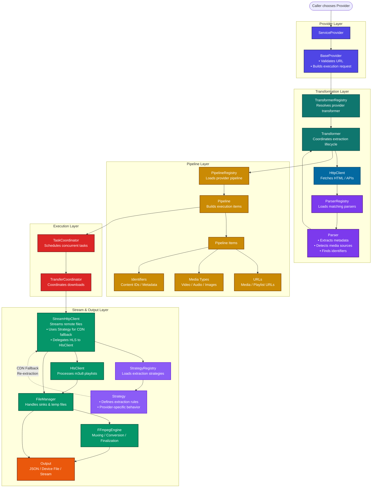

# downflux

Modular TypeScript media extraction and download toolkit. Each site integration is split into a provider, parser, transformer, and pipeline so extraction rules, output mapping, and download planning stay easy to update independently.

## Installation

Requires **Node.js 22 or newer**.

```bash
npm install downflux
```

```bash
pnpm add downflux
```

## Usage

Extraction only. This is the default and writes nothing but a JSON record of what was found:

```ts
import { BeegProvider } from 'downflux/providers';

const provider = new BeegProvider('https://beeg.com/example-video-url');
const result = await provider.getVideo();

console.log(result);
```

Downloading to disk. Provider methods resolve as soon as extraction finishes, so you learn what is
coming without waiting for it; `whenSettled()` waits for the transfers:

```ts
import { BeegProvider } from 'downflux/providers';
import { OutputType } from 'downflux/types';

const provider = new BeegProvider('https://beeg.com/example-video-url')
  .setOutput(OutputType.DEVICE, { directoryPath: '/srv/media' });

const metadata = await provider.getVideo();
const { downloaded, failed, errors } = await provider.whenSettled();
```

`whenSettled()` resolves even when some items fail, because a partial batch is a normal result -
inspect `failed` and `errors`. It rejects only if the download pipeline itself could not run.

## Entry Points

There is no root entry. Every import names the package directory it comes from, so a symbol
has exactly one import path and you only pay for what you name.

```ts
import { OutputType } from 'downflux/types';
import { FileManager } from 'downflux/storage';
import { BeegProvider } from 'downflux/providers';
```

| Subpath | Contents |
| --- | --- |
| `downflux/providers` | every site integration |
| `downflux/base` | `BaseProvider`, `BaseParser`, `BaseTransformer`, `BasePipeline`, `BaseStrategy` |
| `downflux/core` | coordinators, registries, progress, exceptions, lifecycle, CLI |
| `downflux/engines` | `HttpClient`, `StreamHttpClient`, `HlsClient` |
| `downflux/storage` | `FileManager`, `FFmpegEngine`, `PathBuilder` |
| `downflux/shared` | constants, helpers, `Brand` |
| `downflux/types` | enums and type-level helpers |
| `downflux/contracts` | interfaces only, erased at runtime |

Bundled cost of a single subpath, measured against a real install:

| Import | Bundle |
| --- | --- |
| `downflux/providers` | 269.8 KB |
| `downflux/storage` | 13.0 KB |
| `downflux/types` | 4.9 KB |

## FFmpeg Setup

DownFlux uses ffmpeg when HLS or fragmented media needs to be finalized into a playable file. The package includes `ffmpeg-static`, but some package managers can block its postinstall script.

If you use pnpm in the consuming app, approve the bundled binary build:

```bash
pnpm approve-builds
```

Select `ffmpeg-static`, then reinstall dependencies if needed.

You can also install ffmpeg yourself:

```bash
brew install ffmpeg
```

Then point DownFlux at that executable:

```ts
import { BeegProvider } from 'downflux/providers';
import { OutputType } from 'downflux/types';

await new BeegProvider('https://beeg.com/example-video-url')
  .setOutput(OutputType.DEVICE, { directoryPath: 'downloads' })
  .setJobOptions({
    transcodeOptions: {
      ffmpegPath: '/opt/homebrew/bin/ffmpeg'
    }
  })
  .getVideo();
```

## Output Modes

`setOutput()` decides what a job produces. Downloading modes run their transfers in the background,
so the bytes arrive through `pipelineHooks.onDownload` and completion comes from `whenSettled()`.

| Mode | Downloads | How you receive it | Memory | Use for |
| ------ | --------- | ----------------- | ------ | ------- |
| `JSON` *(default)* | no | Writes a `.json` metadata file, returns metadata | trivial | Cataloguing, debugging a provider |
| `RETURN` | no | Returns metadata, writes nothing | trivial | Feeding your own pipeline or database |
| `DEVICE` | yes | Files on disk under `dirConfig.directoryPath` | constant | Anything large; batch jobs; media libraries |
| `STREAM` | yes | A `Readable` per item, via `onDownload` | constant | HTTP responses, object storage uploads |

`DEVICE` streams to a `.part` file and renames on success, so an interrupted run never leaves a
truncated file at the real name. Pass an **absolute** `directoryPath` on a server; relative paths
resolve against `process.cwd()`. A URI such as `s3://bucket/media` is rejected - that is a remote
target, not a filesystem path, so use `STREAM` and pipe to your storage client instead.

### Serving over HTTP

```ts
import { PornHubProvider } from 'downflux/providers';
import { OutputType } from 'downflux/types';
import { pipeline } from 'stream/promises';

await new PornHubProvider(url)
  .setOutput(OutputType.STREAM)
  .setJobOptions({
    pipelineHooks: [
      {
        onDownload: async ({ result }) => {
          reply.writeHead(200, {
            'content-type': result.mimeType,
            // present only when bytes pass through untouched
            ...(result.sizeBytes ? { 'content-length': String(result.sizeBytes) } : {}),
            // omit this header to play inline instead of downloading
            'content-disposition': `attachment; filename="${result.originalFilename}"`
          });

          await pipeline(result.stream!, reply);
        }
      }
    ]
  })
  .getVideo();
```

Consume the stream promptly; an unread one stalls the transfer behind the pipe buffer.

Segmented sources are remuxed on the fly into **fragmented** MP4, which a pipe can carry but a
regular MP4 cannot. Those responses have no `Content-Length`, so the browser shows no percentage and
cannot seek. `result.estimatedBytes` is a best-effort source size for progress UI - never send it as
`Content-Length`. When seeking matters, download with `DEVICE` and serve the finished file.

### Uploading to object storage

```ts
import { Upload } from '@aws-sdk/lib-storage';

onDownload: async ({ result }) => {
  await new Upload({
    client: s3,
    params: { Bucket: 'my-bucket', Key: result.originalFilename, Body: result.stream, ContentType: result.mimeType }
  }).done();
}
```

## Cancelling A Job

`DEVICE` jobs handle `SIGINT`/`SIGTERM` by default: in-flight transfers abort, each deletes its own
`.part` file, the job reports `ABORTED`, and the process exits once cleanup finishes. A second Ctrl+C
exits immediately.

Other modes leave signals alone, since servers own their own shutdown. Set `abortOnSignal` to
override either default, or drive cancellation yourself:

```ts
const controller = new AbortController();

const provider = new PornHubProvider(url)
  .setOutput(OutputType.DEVICE, { directoryPath: '/srv/media' })
  .setJobOptions({ signal: controller.signal, abortOnSignal: false });
```

Call `provider.dispose()` when finished to detach the progress renderer, or
`dispose({ closeConnections: true })` to also close the shared undici pools.

## Progress Output

`setProgressLogging(true)` renders a live panel that redraws in place, with a bar per concurrent
item, transfer rate and ETA. It uses no colour dependency and degrades to plain append-only text
when stdout is not a TTY, when `NO_COLOR` is set, or under `TERM=dumb`.

```ts
provider.setProgressLogging(true, { captureConsole: true });
```

`captureConsole` routes your own `console.log` around the live region so it is not erased by the next
frame. It is off by default because it patches `stdout`/`stderr`, which is the host application's
call to make.

For programmatic progress use `onProgress`, which reports aggregate counters plus an `activeItems`
snapshot carrying per-item bytes, rate and ETA.

## Documentation

The generated Markdown API docs live in [`docs-md`](docs-md/README.md).

Useful entry points:

- [BaseProvider](docs-md/classes/BaseProvider.md) - public provider API and fluent execution options.
- [BaseParser](docs-md/classes/BaseParser.md) - shared HTML extraction helpers.
- [BaseTransformer](docs-md/classes/BaseTransformer.md) - fetches pages and normalizes parser output.
- [BasePipeline](docs-md/classes/BasePipeline.md) - turns extracted metadata into downloadable items.
- [ExecutionCoordinator](docs-md/classes/ExecutionCoordinator.md) - job-level extraction and output flow.
- [TaskCoordinator](docs-md/classes/TaskCoordinator.md) - concurrency, hooks, and background downloads.
- [TransferCoordinator](docs-md/classes/TransferCoordinator.md) - streams one pipeline item into storage.
- [HttpClient](docs-md/classes/HttpClient.md), [StreamHttpClient](docs-md/classes/StreamHttpClient.md), and [HlsClient](docs-md/classes/HlsClient.md) - HTTP and HLS engines.
- [FileManager](docs-md/classes/FileManager.md) and [FFmpegEngine](docs-md/classes/FFmpegEngine.md) - output sinks, filenames, JSON, and media finalization.
- [ProgressManager](docs-md/classes/ProgressManager.md), [CliManager](docs-md/classes/CliManager.md), and [TerminalSurface](docs-md/classes/TerminalSurface.md) - progress state and terminal rendering.
- [SignalHandler](docs-md/classes/SignalHandler.md) - shutdown tasks and cancellation on process signals.
- [JobSettlement](docs-md/interfaces/JobSettlement.md) and [ItemProgressSnapshot](docs-md/interfaces/ItemProgressSnapshot.md) - what `whenSettled()` and `onProgress` hand back.
- [Provider](docs-md/enumerations/Provider.md), [OutputType](docs-md/enumerations/OutputType.md), [ExecutionType](docs-md/enumerations/ExecutionType.md), [VideoQuality](docs-md/enumerations/VideoQuality.md).

Regenerate the Markdown docs with:

```bash
pnpm run docs:md
```

## How The Service Works



In short: a provider creates a typed request, coordinators run the extraction/download flow, registries load the correct provider-specific classes, engines handle network transport, pipelines decide what should be downloaded, and storage writes or returns the result.

## Available Sites

| Site                                                                 | Provider               | Short description                                                             |
| -------------------------------------------------------------------- | ---------------------- | ----------------------------------------------------------------------------- |
| [AnalRz](docs-md/classes/AnalRzProvider.md) <sup>new</sup>           | `AnalRzProvider`       | MP4 downloads; under development.                                             |
| [Beeg](docs-md/classes/BeegProvider.md)                              | `BeegProvider`         | MP4 downloads, HLS downloads; geo-sensitive, under development.               |
| [BlackPorn](docs-md/classes/BlackPornProvider.md) <sup>new</sup>     | `BlackPornProvider`    | MP4 downloads; under development.                                             |
| [BoKepPorn](docs-md/classes/BoKepPornProvider.md) <sup>new</sup>     | `BoKepPornProvider`    | MP4 downloads, KVS metadata; under development.                               |
| [ColliderPorn](docs-md/classes/ColliderPornProvider.md)              | `ColliderPornProvider` | MP4 downloads, HLS downloads, embeds; geo-sensitive, under development.       |
| [CumLouder](docs-md/classes/CumLouderProvider.md)                    | `CumLouderProvider`    | MP4 discovery; under development.                                             |
| [DaFreePorn](docs-md/classes/DaFreePornProvider.md) <sup>new</sup>   | `DaFreePornProvider`   | MP4 downloads, KVS metadata; under development.                               |
| [DaNude](docs-md/classes/DaNudeProvider.md) <sup>new</sup>           | `DaNudeProvider`       | MP4 downloads, KVS metadata; under development.                               |
| [EpicGfs](docs-md/classes/EpicGfsProvider.md)                        | `EpicGfsProvider`      | MP4 downloads, KVS metadata; under development.                               |
| [EPorner](docs-md/classes/EPornerProvider.md)                        | `EPornerProvider`      | MP4 downloads, HLS downloads; external API, geo-sensitive, under development. |
| [HqPorn](docs-md/classes/HqPornProvider.md)                          | `HqPornProvider`       | MP4 downloads; under development.                                             |
| [Interracial](docs-md/classes/InterracialProvider.md) <sup>new</sup> | `InterracialProvider`  | MP4 downloads, KVS metadata; under development.                               |
| [ItsPorn](docs-md/classes/ItsPornProvider.md) <sup>new</sup>         | `ItsPornProvider`      | MP4 downloads, KVS metadata; under development.                               |
| [Lesbian8](docs-md/classes/Lesbian8Provider.md)                      | `Lesbian8Provider`     | MP4 downloads, KVS metadata; under development.                               |
| [MegaTube](docs-md/classes/MegaTubeProvider.md)                      | `MegaTubeProvider`     | MP4 downloads, KVS metadata; under development.                               |
| [MomVids](docs-md/classes/MomVidsProvider.md) <sup>new</sup>         | `MomVidsProvider`      | MP4 downloads, KVS metadata; under development.                               |
| [MyLust](docs-md/classes/MyLustProvider.md)                          | `MyLustProvider`       | MP4 downloads; under development.                                             |
| [OkPorn](docs-md/classes/OkPornProvider.md)                          | `OkPornProvider`       | HLS downloads; under development.                                             |
| [PerfectGirls](docs-md/classes/PerfectGirlsProvider.md)              | `PerfectGirlsProvider` | HLS downloads; under development.                                             |
| [Porn300](docs-md/classes/Porn300Provider.md)                        | `Porn300Provider`      | MP4 discovery; under development.                                             |
| [PornDoe](docs-md/classes/PornDoeProvider.md)                        | `PornDoeProvider`      | MP4 downloads; external API, under development.                               |
| [PornHub](docs-md/classes/PornHubProvider.md)                        | `PornHubProvider`      | MP4 downloads, HLS downloads, KVS metadata; under development.                |
| [PornId](docs-md/classes/PornIdProvider.md)                          | `PornIdProvider`       | MP4 downloads, KVS metadata; under development.                               |
| [PornOne](docs-md/classes/PornOneProvider.md)                        | `PornOneProvider`      | MP4 downloads; Cloudflare challenge, under development.                       |
| [PornSeven](docs-md/classes/PornSevenProvider.md)                    | `PornSevenProvider`    | MP4 discovery; under development.                                             |
| [PornsOk](docs-md/classes/PornsOkProvider.md)                        | `PornsOkProvider`      | MP4 downloads; under development.                                             |
| [PussySpace](docs-md/classes/PussySpaceProvider.md)                  | `PussySpaceProvider`   | MP4 downloads; external API, under development.                               |
| [SexVid](docs-md/classes/SexVidProvider.md)                          | `SexVidProvider`       | MP4 downloads, KVS metadata; under development.                               |
| [Shameless](docs-md/classes/ShamelessProvider.md)                    | `ShamelessProvider`    | MP4 downloads, KVS metadata; under development.                               |
| [SuperPorn](docs-md/classes/SuperPornProvider.md)                    | `SuperPornProvider`    | MP4 downloads; under development.                                             |
| [SxyPorn](docs-md/classes/SxyPornProvider.md)                        | `SxyPornProvider`      | MP4 downloads; Cloudflare challenge, under development.                       |
| [TheyAreHuge](docs-md/classes/TheyAreHugeProvider.md)                | `TheyAreHugeProvider`  | MP4 downloads, KVS metadata; login required, under development.               |
| [TnAFlix](docs-md/classes/TnAFlixProvider.md)                        | `TnAFlixProvider`      | MP4 downloads; geo-sensitive, under development.                              |
| [TubeVSex](docs-md/classes/TubeVSexProvider.md)                      | `TubeVSexProvider`     | MP4 downloads; under development.                                             |
| [WallHaven](docs-md/classes/WallHavenProvider.md)                    | `WallHavenProvider`    | Provider-specific extraction; under development.                              |
| [XCafe](docs-md/classes/XCafeProvider.md)                            | `XCafeProvider`        | MP4 downloads; under development.                                             |
| [XDegu](docs-md/classes/XDeguProvider.md)                            | `XDeguProvider`        | MP4 downloads, KVS metadata; under development.                               |
| [XGroovy](docs-md/classes/XGroovyProvider.md)                        | `XGroovyProvider`      | MP4 downloads; under development.                                             |
| [XHamster](docs-md/classes/XHamsterProvider.md)                      | `XHamsterProvider`     | MP4 downloads, HLS downloads; under development.                              |
| [XnXX](docs-md/classes/XnXXProvider.md)                              | `XnXXProvider`         | MP4 downloads, HLS downloads; under development.                              |
| [Xozilla](docs-md/classes/XozillaProvider.md) <sup>new</sup>         | `XozillaProvider`      | MP4 downloads, KVS metadata; under development.                               |
| [XVideos](docs-md/classes/XVideosProvider.md)                        | `XVideosProvider`      | MP4 discovery, HLS downloads, KVS metadata; under development.                |
| [ZbPorn](docs-md/classes/ZbPornProvider.md) <sup>new</sup>           | `ZbPornProvider`       | MP4 downloads, KVS metadata; under development.                               |
| [ZzzTube](docs-md/classes/ZzzTubeProvider.md)                        | `ZzzTubeProvider`      | MP4 downloads; under development.                                             |

## Gallery & General Providers (not yet fully implemented)

These are scaffolding. They are exported and registered like any other provider, but throw
`NotImplementedException` rather than emitting placeholder output, so an unfinished provider fails
loudly instead of producing files that look valid. Providers whose metadata declares
`canDownload: false` or `requiresBrowser: true` reject downloads up front for the same reason.

| Site                                                               | Provider             | Short description                                                                               |
| ------------------------------------------------------------------ | -------------------- | ----------------------------------------------------------------------------------------------- |
| [ArtStation](docs-md/classes/ArtStationProvider.md) <sup>new</sup> | `ArtStationProvider` | Art gallery extraction; under development.                                                      |
| [Behance](docs-md/classes/BehanceProvider.md) <sup>new</sup>       | `BehanceProvider`    | Portfolio platform extraction; requires API, under development.                                 |
| [Bluesky](docs-md/classes/BlueskyProvider.md) <sup>new</sup>       | `BlueskyProvider`    | Social media extraction; requires API, under development.                                       |
| [Danbooru](docs-md/classes/DanbooruProvider.md) <sup>new</sup>     | `DanbooruProvider`   | Anime image board extraction; under development.                                                |
| [DeviantArt](docs-md/classes/DeviantArtProvider.md) <sup>new</sup> | `DeviantArtProvider` | Art community extraction; requires API, under development.                                      |
| [Flickr](docs-md/classes/FlickrProvider.md) <sup>new</sup>         | `FlickrProvider`     | Photo sharing extraction; under development.                                                    |
| [Gelbooru](docs-md/classes/GelbooruProvider.md) <sup>new</sup>     | `GelbooruProvider`   | Anime image board extraction; under development.                                                |
| [Imgur](docs-md/classes/ImgurProvider.md) <sup>new</sup>           | `ImgurProvider`      | Image hosting extraction; under development.                                                    |
| [Instagram](docs-md/classes/InstagramProvider.md) <sup>new</sup>   | `InstagramProvider`  | Social media extraction; login required, Cloudflare challenge, under development.               |
| [MangaDex](docs-md/classes/MangaDexProvider.md) <sup>new</sup>     | `MangaDexProvider`   | Manga reader extraction; under development.                                                     |
| [Mastodon](docs-md/classes/MastodonProvider.md) <sup>new</sup>     | `MastodonProvider`   | Social media extraction; geo-sensitive, under development.                                      |
| [Newgrounds](docs-md/classes/NewgroundsProvider.md) <sup>new</sup> | `NewgroundsProvider` | Art portal extraction; under development.                                                       |
| [Pexels](docs-md/classes/PexelsProvider.md) <sup>new</sup>         | `PexelsProvider`     | Stock photo extraction; under development.                                                      |
| [Pinterest](docs-md/classes/PinterestProvider.md) <sup>new</sup>   | `PinterestProvider`  | Image sharing extraction; requires API, Cloudflare challenge, under development.                |
| [Pixiv](docs-md/classes/PixivProvider.md) <sup>new</sup>           | `PixivProvider`      | Art community extraction; requires API, login required, under development.                      |
| [Reddit](docs-md/classes/RedditProvider.md) <sup>new</sup>         | `RedditProvider`     | Social media extraction; under development.                                                     |
| [TikTok](docs-md/classes/TikTokProvider.md) <sup>new</sup>         | `TikTokProvider`     | Video platform extraction; requires API, Cloudflare challenge, under development.               |
| [Tumblr](docs-md/classes/TumblrProvider.md) <sup>new</sup>         | `TumblrProvider`     | Social media extraction; under development.                                                     |
| [Twitter](docs-md/classes/TwitterProvider.md) <sup>new</sup>       | `TwitterProvider`    | Social media extraction; requires API, login required, Cloudflare challenge, under development. |
| [Unsplash](docs-md/classes/UnsplashProvider.md) <sup>new</sup>     | `UnsplashProvider`   | Stock photo extraction; under development.                                                      |
| [WikiArt](docs-md/classes/WikiArtProvider.md) <sup>new</sup>       | `WikiArtProvider`    | Art museum extraction; under development.                                                       |
| [Wikimedia](docs-md/classes/WikimediaProvider.md) <sup>new</sup>   | `WikimediaProvider`  | Media library extraction; geo-sensitive, under development.                                     |

More incoming...

## Development

Requires Node.js 22 or newer.

```bash
pnpm install
pnpm run build
pnpm run docs:md
```

`.gitignore` ignores `*.md`, so newly generated documentation pages need forcing:

```bash
git add -f docs-md
```

## Add new Provider

To add a new provider you can run this following commands.

Use the --no-[registryCoordinatorType] to exclude that file.

Available flags: strategy | transformer | pipeline | method

```bash
pnpm run make:registry [registryName] OR
pnpm run make:registry --no-strategy Twitter
```

After running the previous command, run this commands sequentially for barrel imports and auto entries

```bash
pnpm run make:index
pnpm run format
pnpm run build
```

The generated docs are intentionally linked from this README so provider and API documentation remain browsable from the repository root.

## Publishing

`main` is protected, so the version bump goes through a pull request and the tag is
created afterwards, against the commit that actually landed.

```bash
# 1. bump the version and write the CHANGELOG (no tag yet)
pnpm run release:prepare          # or release:prepare:major for a breaking release

# 2. land the version commit
git checkout -b release/v$(node -p "require('./package.json').version")
git push -u origin HEAD
gh pr create -t "Release v$(node -p "require('./package.json').version")" -b "" && gh pr merge -sd

# 3. tag the merged commit and publish
git checkout main && git pull
pnpm run release:tag
pnpm run release:publish
```

`release:tag` refuses to run unless `HEAD` is already on `origin/main`. Tagging before the
pull request is merged strands the tag: a squash merge rewrites the commit, so the tag ends
up pointing at an orphan that is not in the released history.

`pnpm run release:dry-run` previews the bump and changelog without writing anything, and
`pnpm run pack:dry-run` rebuilds and lists the files npm will receive.
